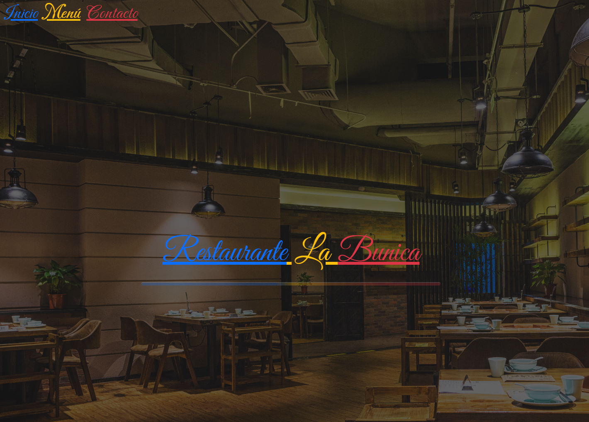
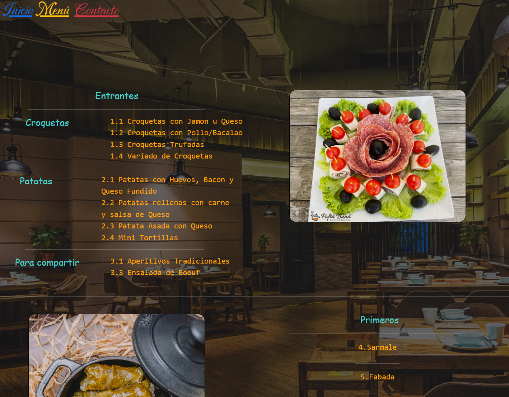
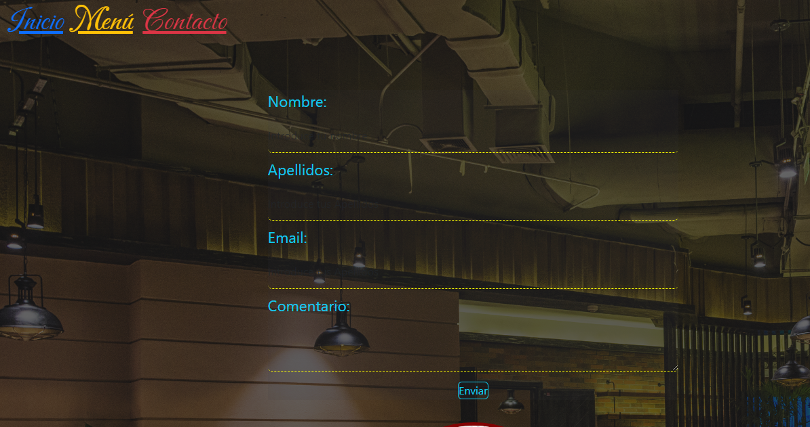
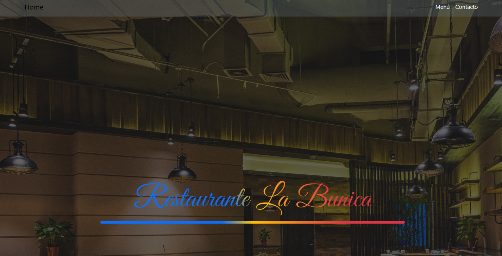
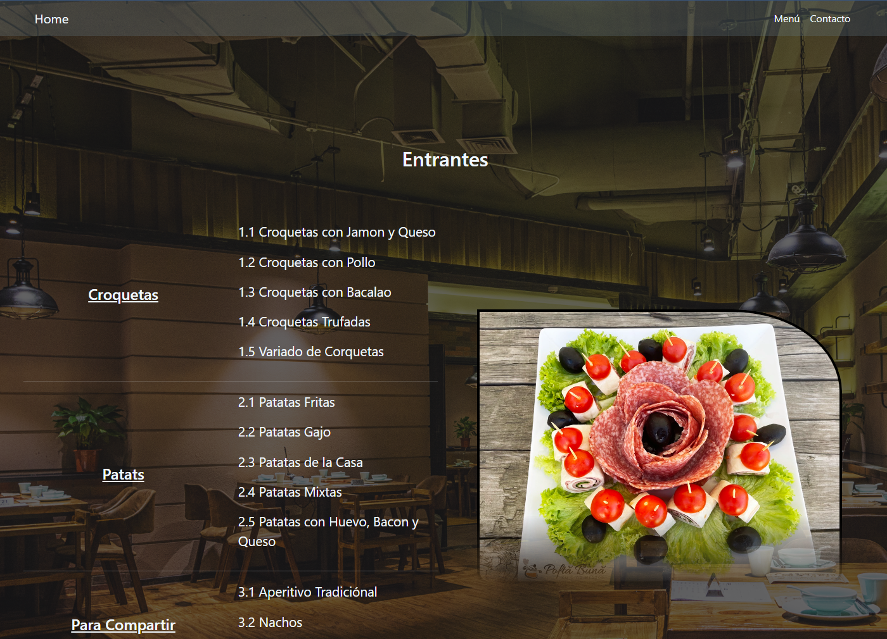
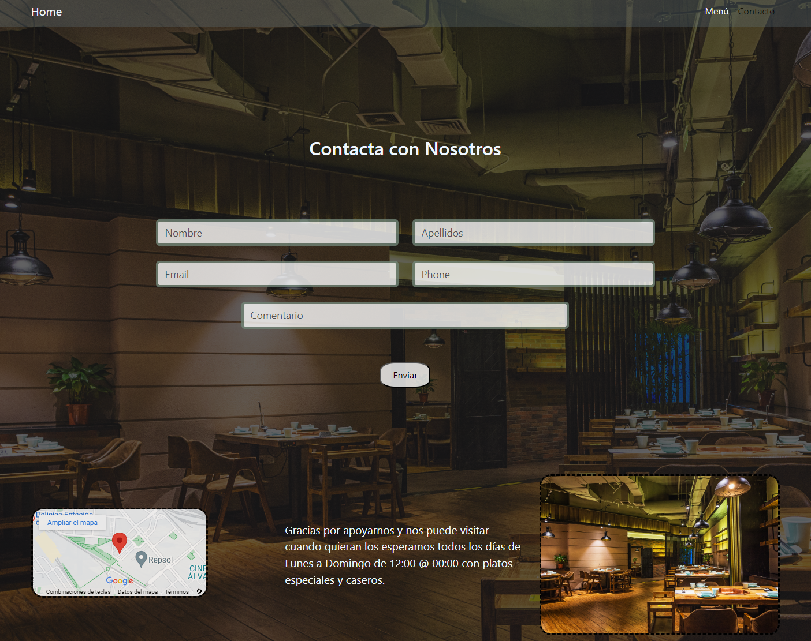
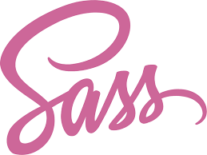

# Bienvenidos a la remasterización del Proyecto Restaurante

## Despliegue

El proyecto está actualmente desplegado en Vercel. Puedes visitar la página web desplegada haciendo clic en el siguiente enlace:

  <em>Nota: El enlace está configurado para abrirse en una nueva ventana. Si el enlace no se abre, intenta hacer clic con el botón derecho y seleccionar "Abrir enlace en una nueva pestaña".</em>

  <a href="https://restaurante-la-bunica.vercel.app/" target="_blank">Restaurante La Bunica</a>

¡Hola! Bienvenidos a la remasterización del Proyecto Restaurante, creado en Septiembre de 2023.

Antes de la remasterización, el proyecto estaba desarrollado con HTML, CSS y Bootstrap. Adjunto fotos de cómo lucía antes, con un 60% de responsividad:

  
  
  

Ahora, el proyecto ha sido totalmente remasterizado utilizando REACT, SASS y REACT-BOOTSTRAP, logrando una responsividad del 100%. Aquí adjunto fotos de cómo luce ahora:

  
  
  
  

Además, he utilizado las siguientes tecnologías en la remasterización del proyecto:

  
  
  

