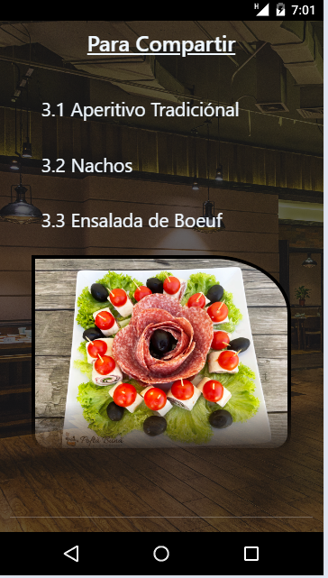

# Bienvenidos a la remasterización del Proyecto Restaurante

¡Hola! Bienvenidos a la remasterización del Proyecto Restaurante, creado en Septiembre de 2023.

Antes de la remasterización, el proyecto estaba desarrollado con HTML, CSS y Bootstrap.Adjuntó fotos de cómo lucía antes, con un 60% de responsividad:

{width=200px}
{width=200px}
{width=200px}

Ahora, el proyecto ha sido totalmente remasterizado utilizando REACT, SASS y REACT-BOOTSTRAP, logrando una responsividad del 100%. Aquí adjunto fotos de cómo luce ahora:

{width=200px}
{width=200px}
{width=200px}
{width=200px}

Además, he utilizado las siguientes tecnologías en la remasterización del proyecto:

- {width=200px}
- {width=200px}
- {width=200px}
